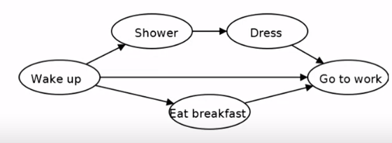
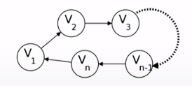

## Directed Graph

#### Definaton

A **Directed Graph** is a graph where each edge has a start vertex and a end vertex.




###### Examples

* Streets with one way roads.
* Links between webpages.
* Followers on social media.
* Dependencies between tasks.

##### Directed DFS

We an still run DFS in directed graphs.

* Only follow directed edges.
* explore(v) finds all vertices rechable from v.
* Can still compute pre- and post-odernings.

#### Defination

A **cycle** in a graph G is a sequence of vertices v1, v2, v3, ..... , v{n} so that (v1, v2), (v2, v3), (v{n - 1}, v{n}), (v{n}, v1) are all edges.



###### Theorm ######
If graph G contains cycles then it cannot be lineary order.

## Directed Acylic Graph

#### Defination

A directed graph G is a **Directed Acylic Graph** (or *DAG*) if it has no cycles.

* Any DAG can be lineary order.

### Source and Sink

#### Defination

1. A **sourec** is a vertex with no incomming edges.
2. A **sink** is a vertex with no outgoing edges.


## Topological Sort

Converting a graph G into linear order.

###### Idea

- Find sink
- put at the end of the order.
- Remove it from the graph.
- Repeat.

To find the sink we do the following:

* Follow the path as far as possible
	- v1 --> v2 --> ... -->v{n}.
	- Eventually either:
		+ It cannot extended (Found the sink).
		+ Repeat the vertex (Have a cycle).


#### LinearOrder(G) (Native)

```

LinearOrder_Native(G) {

	while G is non-empty:
		Follow a path untill cannot extend
		Find the sink v
		Put v at the end of the oredr
		Remoce v from the G

}

```

`Runtime: ` O($|V|^2$)

#### Topological_sort(G)

```

Topological_sort(G) {

	DFS(G)
	sort the vertices by the reverse post_order.

}