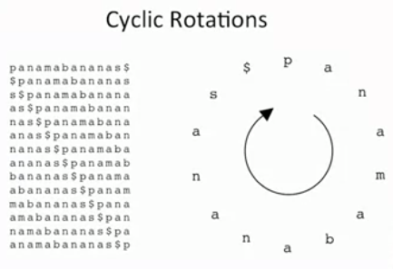
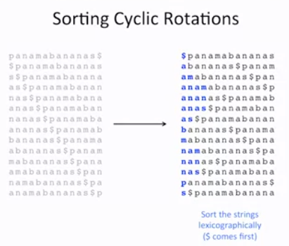
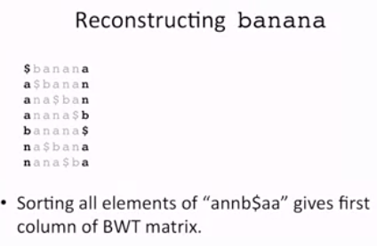
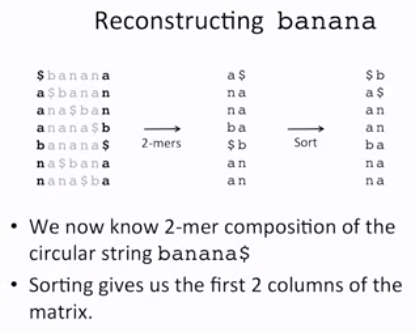
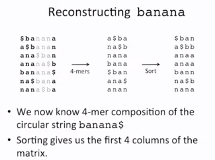
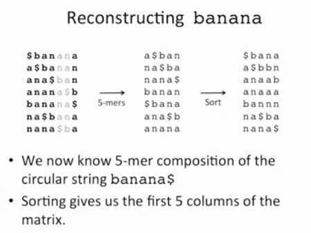
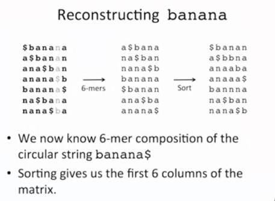
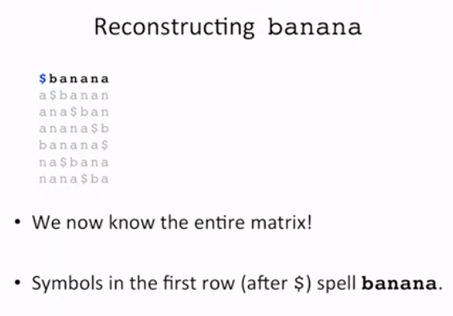
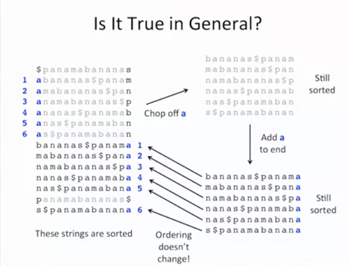

## Burrows Wheeler Tramsformation

The **Burrows Wheeler Tramsformation** is a data tramsformation algorithm that structured the data in such a way that the transformed message is more compressable.

#### Main Idea

The idea of the BWT is to build an array whose rows are all the cyclic shift of the input string in a dictionary order and returns the last colom of the array that tends to have long identical charecters.

#### Steps

1. Form all the cyclic rotation of the string.
2. Sort the rotation in the lexicographically order. The '$' symbol came before letter 'a'.
3. The last coloum of the reguired order in the required BWT.

The given below is the Burrows Wheeler Tramsformation of the word '**panamabanana$**'

- **Step 1**

- **Step 2**

- **Step 3**

## Inverting  Burrows-Wheeler Transform

We are given the BWT of a given string. And we need to convert back it to the original sentence.

#### Steps

- Sorting all the elements of the BWT will give us the first coloum of the BWT matrix.
- Hence we know the 2-mer composition of the original circular string.
- Sorting the 2-mers will give us the first 2 coloums of the matrix.
- Again go to the original BWT and repeat the above two steps till get the final word.

The given below is the  Inverse of Burrows Wheeler Tramsformation of the word '**banana$**'

- **Step 1**

- **Step 2**

- **Step 3**

- **Step 4**

- **Step 5**

- **Step 6**

- **Step 7**

- **Step 8**

##### Memory Issue

- Reconstruction of the TEXT from the BWT(TEXT) required us to store |TEXT| cycles rotation of the |TEXT|.

- **Running Time:** O(|TEXT|^3 . log(|TEXT|) )

## Faster Inverting  Burrows-Wheeler Transform

**Strange Observaion:**

>The i-th position of the any letter in first coloum is hiding at the same position along the i-th position of letter in the i-th coloum.

### First-Last Property

The k-th occurrence of symbol in *First Coloum* and the k-th occurrence of symbol in *Last Coloum* corrospond to the same position in the text.

- Using the first-last property:
	+ **Memory:** 2.|TEXT|
	+ **Time:** O(|TEXT|)